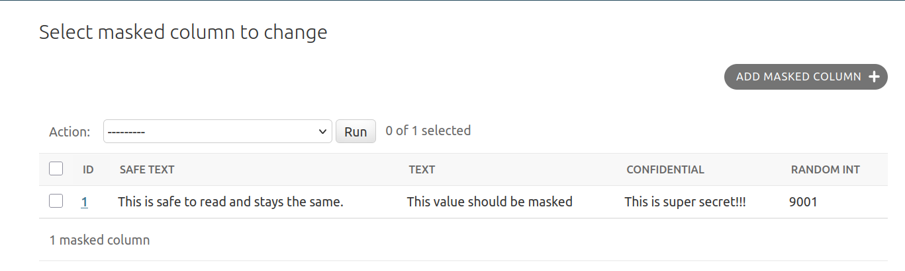
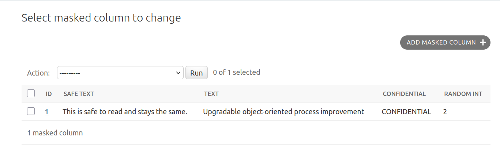

# Django Security Label

Django support for [PostgreSQL security labels](https://www.postgresql.org/docs/current/sql-security-label.html).

## Overview

This package provides tools for applying and managing security labels in PostgreSQL databases on your Django models. This can allow you to dynamically mask specific columns to limit a user's ability to find sensitive data.

This was created with [Jay Miller](https://kjaymiller.com/) for the ["Elephant in the Room" series](https://www.youtube.com/watch?v=oSDPKT5bbuw&list=PLo6PI-0mPVLszndcJ86JStMHLibO2BHdc). The inspiration for the project was from his blog post, ["Using PostgreSQL Anonymizer to safely share data with LLMs"](https://aiven.io/blog/using-postgresql-anonymizer-to-safely-share-data-with-llms)

## Installation

```bash
pip install django-security-label
```

### 1. Add the app to your `INSTALLED_APPS`:

```python
INSTALLED_APPS = [
    # ...
    "django_security_label",
]
```

### 2. Enable the middleware for relevant environments:

```python
if ENVIRONMENT_VARIABLE == "staging":
    MIDDLEWARE = [
        "django.contrib.sessions.middleware.SessionMiddleware",
        "django.contrib.auth.middleware.AuthenticationMiddleware",
        # MaskedReadsMiddleware must be after AuthenticationMiddleware because
        # it requires a write to the database.
        "django_security_label.middleware.MaskedReadsMiddleware",
    ]
```
Note: The PostgreSQL role that is used for masked reads will not have the ability to insert, update or delete data on any table that has a masking security label applied to it.

### 3. Run the migrations. This will install the [`anon` provider](https://postgresql-anonymizer.readthedocs.io/) and configure [dynamic masking](https://postgresql-anonymizer.readthedocs.io/en/stable/dynamic_masking/). It will also create the ``dsl_masked_reader`` role with the same permissions as your database user.

```bash
python manage.py migrate django_security_label
```
You can view the SQL with: ``python manage.py sqlmigrate django_security_label 0001``

### 4. Define your security labels on your models:

```python
class MyModel(models.Model):
    text = models.TextField()
    confidential = models.TextField()
    random_int = models.IntegerField()

    class Meta:
        # Defining any security labels will prevent any changes to the table
        # when masking is enabled.
        indexes = [
            labels.MaskColumn(
                fields=["text"], mask_function=labels.MaskFunction.dummy_catchphrase
            ),
            labels.AnonymizeColumn(
                fields=["confidential"],
                provider="anon",
                string_literal="MASKED WITH VALUE $$CONFIDENTIAL$$",
            ),
            labels.AnonymizeColumn(
                fields=["random_int"],
                provider="anon",
                string_literal="MASKED WITH FUNCTION anon.random_int_between(0,50)",
            ),
        ]
```

### 5. Create migrations and add a dependency on ``("django_security_label", "0001)``

```bash
python manage.py makemigrations
```
The dependency on ``("django_security_label", "0001_initial")`` will ensure that your security labels will be applied after the anon provider is installed.

Example migration file:

```python
from django.db import migrations, models
import django_security_label.labels


class Migration(migrations.Migration):
    initial = True

    dependencies = [
        ("django_security_label", "0001_initial"),
    ]

    operations = [
        migrations.CreateModel(
            name="MyModel",
            fields=[
                (
                    "id",
                    models.BigAutoField(
                        auto_created=True,
                        primary_key=True,
                        serialize=False,
                        verbose_name="ID",
                    ),
                ),
                ("text", models.TextField()),
                ("confidential", models.TextField()),
                ("random_int", models.IntegerField()),
            ],
            options={
                "indexes": [
                    django_security_label.labels.MaskColumn(
                        fields=["text"],
                        mask_function=django_security_label.labels.MaskFunction[
                            "dummy_catchphrase"
                        ],
                        name="mymodel_text_6adba0_idx",
                        provider="anon",
                        string_literal="MASKED WITH FUNCTION anon.dummy_catchphrase()",
                    ),
                    django_security_label.labels.AnonymizeColumn(
                        fields=["confidential"],
                        name="mymodel_confide_030817_idx",
                        provider="anon",
                        string_literal="MASKED WITH VALUE $$CONFIDENTIAL$$",
                    ),
                    django_security_label.labels.AnonymizeColumn(
                        fields=["random_int"],
                        name="mymodel_random__45b12e_idx",
                        provider="anon",
                        string_literal="MASKED WITH FUNCTION anon.random_int_between(0,50)",
                    ),
                ],
            },
        ),
    ]
```

## Documentation

### Examples

Below are examples of the Django admin using the masked reading with a superuser and a typical staff user.

#### Superuser / unmasked Read


#### Staff user / masked Read


### Controlling masked reads

The default configuration of this package uses dynamic masking. This is because static masking will irrevocably destroy your database's data. While this is a valuable tool for some staging environments, it's not the goal at the moment.

The challenge is to use a different database role when we need to have masked reads. This is why we create the ``dsl_masked_reader`` role. We can switch to this role with ``SET SESSION ROLE dsl_masked_reader;`` and ``ROLE RESET;`` to enable and disable masked reads respectively.

The middleware, ``MaskedReadsMiddleware`` controls when the role is switched. It does so crudely at this point by only allowing ``user.is_superuser`` users to use the default database role. All other queries will use the ``dsl_masked_reader`` role and be subject to the security labels that were defined on the columns.

#### Customizing when masking is used

Please copy and update the code in ``MaskedReadsMiddleware`` to suit your needs. The majority of the complexity will be in your definition of ``use_masked_reads``.


For example, if you only wanted to force anonymous users to have masked reads:

```python
from __future__ import annotations

from django.db import connection
from django.http import HttpRequest
from django_security_label.middleware import enable_masked_reads, disable_masked_reads


def use_masked_reads(request: HttpRequest) -> bool:
    user = getattr(request, "user", None)
    return user is None or not user.is_authenticated


class AnonymousOnlyMaskedReadsMiddleware:
    def __init__(self, get_response):
        self.get_response = get_response

    def __call__(self, request):
        if enable_masking := use_masked_reads(request):
            enable_masked_reads()

        response = self.get_response(request)

        if enable_masking:
            disable_masked_reads()

        return response
```

### Masking functions

The PostgreSQL Anonymizer provider [includes dozens of functions](https://postgresql-anonymizer.readthedocs.io/en/stable/masking_functions/).

You can use a predefined function such as ``fake_email`` the following:

```python
from django_security_label import labels

labels.MaskColumn(fields=["email"], mask_function=labels.MaskFunction.fake_email)
```

You can also define the [string literal portion of the ``SECURITY LABEL``](https://www.postgresql.org/docs/current/sql-security-label.html) with the following:

```python
labels.AnonymizeColumn(
    fields=["confidential"],
    provider="anon",
    string_literal="MASKED WITH VALUE $$CONFIDENTIAL$$",
),
```
