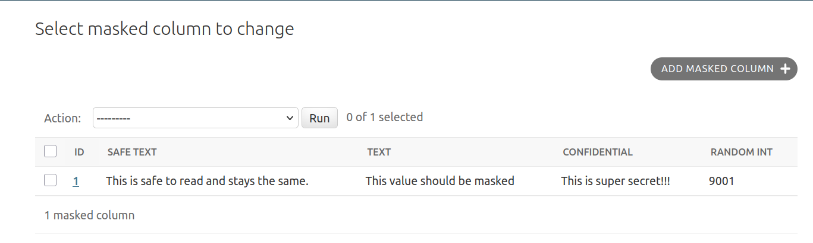
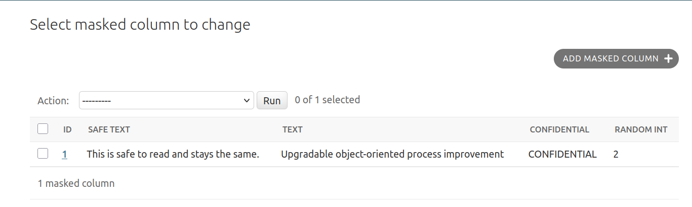

# Running the Example App

This tutorial walks through the ``example`` project included in the repository to demonstrate masked reads in the Django admin. By the end, you'll see how different PostgreSQL roles produce different masked views of the same data.

## Prerequisites

Before starting, make sure you have the following installed:

- [Git](https://git-scm.com/book/en/v2/Getting-Started-Installing-Git)
- [uv](https://docs.astral.sh/uv/getting-started/installation/)
- A running PostgreSQL instance with the [PostgreSQL Anonymizer](https://postgresql-anonymizer.readthedocs.io/en/stable/INSTALL/) extension installed.

You can also run the following [Docker](https://docs.docker.com/get-started/get-docker/) container:

```bash
docker run -d -e POSTGRES_PASSWORD=django-security-label -e POSTGRES_USER=django-security-label -p 6432:5432 registry.gitlab.com/dalibo/postgresql_anonymizer
```

## Clone the repository

```bash
git clone https://github.com/tim-schilling/django-security-label.git
cd django-security-label
```

## Run the example app

1. Run migrations:

    ```bash
    uv run python -m example.manage migrate
    ```

2. Create the PostgreSQL roles and Django groups defined in ``SECURITY_LABEL_GROUPS_TO_POLICIES``:

    ```bash
    uv run python example/manage.py setup_policies
    ```

    This will create PostgreSQL roles that will be clones of the user used in the ``DATABASES`` setting. Authenticated users of the running ``example`` Django project that are a part of the ``auth.Group`` will have any database connections use the associated PostgreSQL role rather than the standard ``DATABASES`` user.

3. Example specific: Set up staff users and sample data:

    ```bash
    uv run python example/manage.py setup_data
    ```

    This will create a staff user for each group with permissions to manage all ``core`` models. You will be prompted to set a password for each user. It also ensures there are at least 3 ``MaskedColumn`` rows and prints a table of the raw data.

4. Run the development server:

    ```bash
    uv run python example/manage.py runserver
    ```

5. Log in as each staff user (e.g. `analysts`, `developers`) and [view the ``MaskedColumn`` list](http://127.0.0.1:8000/admin/core/maskedcolumn/). Compare the values shown in the admin to the raw data printed by `setup_data` to see how each role's masking rules affect the data.

## What it looks like

### Superuser / unmasked read



### Staff user / masked read


